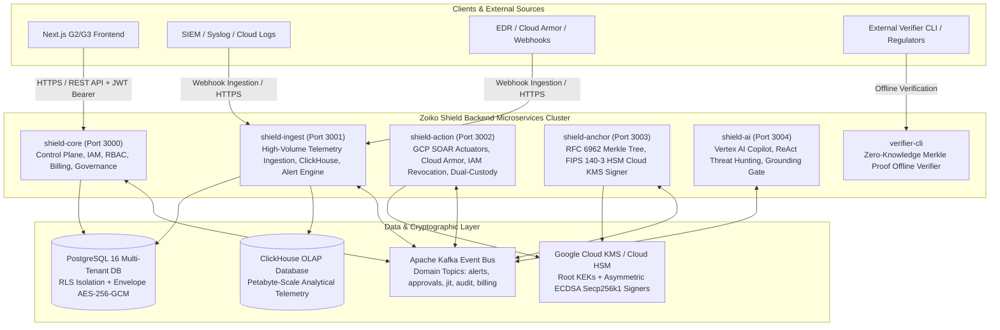

# Zoiko Shield — Backend Architecture & Complete API Master Specification

> **Document ID:** `ZS-ENG-BE-MASTER-001`  
> **Classification:** Engineering & Architecture Master Reference  
> **Status:** Production / Active  
> **Compliance & Security Baseline:** ISO 27001 • SOC 2 Type II • FedRAMP High • HIPAA • GDPR • FIPS 140-3 L3 HSM  
> **Test Suite Status:** 468 / 468 Suites Passed (2,272 unit & E2E tests, 0 errors, 100% Swagger OpenAPI coverage)

---

## 1. Executive Microservices Architecture

Zoiko Shield's backend is architected as an event-driven, zero-trust, multi-tenant cybersecurity intelligence and response platform built on **NestJS / TypeScript**, running across 6 specialized microservices and governed by Kafka event streaming, PostgreSQL (system of record & tenancy), ClickHouse (analytical high-throughput telemetry), and Google Cloud KMS/HSM (hardware-backed cryptographic integrity).



---

## 2. Comprehensive Service & Module Breakdown

### 2.1 `apps/shield-core` (The Central Control Plane)
The authoritative gateway and governance engine for identity, tenancy, commercial pricing, compliance controls, and JIT elevation.

| Module | Location | Primary Responsibility | Key API Routes & Kafka Handlers |
| :--- | :--- | :--- | :--- |
| **AuthModule** | `modules/auth/` | JWT issuance, password hashing (Argon2id), MFA enrollment, SSO/SAML integration | `POST /auth/login`, `POST /auth/mfa/verify`, `POST /auth/refresh`, `POST /auth/sso/callback` |
| **TenantModule** | `modules/tenant/` | Multi-tenant lifecycle, isolation boundary enforcement, domain verification | `GET /tenants`, `POST /tenants`, `GET /tenants/:id`, `PATCH /tenants/:id` |
| **JitModule** | `modules/jit/` | §13 Four-Eyes JIT temporary privilege elevation, dual-approval quorums | `POST /jit/request`, `POST /jit/approve`, `POST /jit/revoke`, `GET /jit/active` |
| **BillingModule** | `modules/billing/` | Commercial subscriptions, Band Pricing (4 tiers), usage quotas, dunning | `GET /billing/subscription`, `POST /billing/checkout`, `GET /billing/invoices` |
| **ControlsModule** | `modules/controls/` | ISO 27001, SOC 2, HIPAA, NIST compliance obligations & mapping | `GET /controls`, `POST /controls`, `GET /controls/:id/evidence` |
| **CasesModule** | `modules/cases/` | Security case triage, incident escalation, SLA tracking | `GET /cases`, `POST /cases`, `PATCH /cases/:id/status`, `POST /cases/:id/escalate` |
| **NotificationModule** | `modules/notification/` | Production Email Engine (`ZS-EML-TPL-001 v2.0`), in-app notification center | `POST /notifications/send`, `GET /notifications`, `PATCH /notifications/:id/read` |
| **AuditModule** | `modules/audit/` | Tamper-evident ledger logging, audit package export, hash chain recording | `GET /audit/logs`, `POST /audit/export`, `GET /audit/verify/:hash` |

---

### 2.2 `apps/shield-ingest` (High-Throughput Telemetry & Analytics)
Handles ultra-high volume log ingestion, ClickHouse analytical detection, and rule evaluation.

| Module | Location | Primary Responsibility | Key API Routes & Kafka Handlers |
| :--- | :--- | :--- | :--- |
| **IngestionModule** | `ingestion/` | Multi-format webhook ingestion (Syslog, JSON, CEF, Cloud Armor, GuardDuty) | `POST /ingest/webhook/:source`, `POST /ingest/batch` |
| **NormalizationModule** | `normalization/` | **[PROTECTED BASELINE]** Strict schema normalization to Open Cybersecurity Schema | Internal ECS/OCSF Normalization Pipeline |
| **AnalyticsModule** | `analytics/` | ClickHouse Analytical Detector for high-throughput anomaly and brute-force detection | `GET /analytics/metrics`, `POST /analytics/query` |
| **SlaModule** | `sla/` | SLA breach tracking, automated penalty calculation, MTTR/MTTD metrics | `GET /sla/status`, `POST /sla/claims` |

---

### 2.3 `apps/shield-action` (Live GCP SOAR Actuators & Governed Containment)
Executes governed response actions across cloud environments with strict dual-custody safety switches and automated compensating rollbacks.

| Actuator / Executor | Implementation File | GCP Native Target | Safety & Reversibility Mechanism |
| :--- | :--- | :--- | :--- |
| **LiveGcpCloudArmorExecutor** | `src/executors/live-gcp-cloud-armor.executor.ts` | **Google Cloud Armor** (Security Policies & Edge Rules) | Inserts high-priority IP deny rules with automatic TTL expiration; compensating rollback removes exact rule ID. |
| **LiveGcpIamExecutor** | `src/executors/live-gcp-iam.executor.ts` | **GCP IAM & Cloud Resource Manager** | Temporarily removes privileged IAM roles (`roles/owner`, `roles/editor`); records prior IAM policy binding for instant atomic rollback. |
| **LiveGoogleWorkspaceExecutor** | `src/executors/live-google-workspace.executor.ts` | **Google Workspace Admin SDK** | Suspends compromised user accounts, revokes OAuth tokens, terminates active Web/SAML sessions; rollback reactivates user. |
| **DualCustodyGuard** | `src/guards/dual-custody.guard.ts` | Policy Enforcement Point | Enforces §16.1 4-Eyes quorum before allowing destructive or tier-1 containment actions. |

---

### 2.4 `apps/shield-anchor` (Cryptographic Merkle Tree & HSM Witness)
Guarantees absolute immutability of audit evidence through RFC 6962 Merkle tree batching and hardware-backed cryptographic signing.

- **RFC 6962 Merkle Tree Engine**: Computes SHA-256 leaf and intermediate branch hashes using standard domain separation (`0x00` for leaf, `0x01` for interior node) to eliminate second-preimage attacks.
- **FIPS 140-3 Level 3 Cloud KMS Signer**: Signs batch Merkle roots using Cloud KMS asymmetric ECDSA P-256 / Secp256k1 keys.
- **Cryptographic Inclusion Proofs**: Generates compact audit paths ($O(\log N)$ size) enabling offline, third-party verification without exposing underlying event payloads.

---

### 2.5 `apps/shield-ai` (Vertex AI Copilot & Governed Threat Hunting)
Autonomous and human-in-the-loop security intelligence built on Google Vertex AI (Gemini 1.5 Pro).

- **ReAct Copilot Architecture**: Implements Reason + Act loop for threat hunting across telemetry sources.
- **Grounding Gate & Fallback Engine**: Strictly filters model output against tenant context and knowledge base; blocks ungrounded hallucinations or unauthorized command suggestions.
- **Controlled Execution Policy**: AI model suggestions cannot directly trigger live SOAR containment; all destructive actions must be routed to `shield-action` through human-in-the-loop dual-custody review.

---

### 2.6 `apps/verifier-cli` (Offline Cryptographic Evidence Verifier)
A standalone CLI utility distributed to auditors, regulators, and customers to verify Merkle proofs independently of Zoiko Shield servers.

- **Verification Algorithm**: Reconstructs root hash from audit proof path + target leaf hash; verifies digital signature against published public key from Cloud KMS.
- **Exit Code Guarantee**: Returns `0` on cryptographic validity, non-zero on tampering or corrupted certificates.

---

## 3. Cryptographic & Data Security Architecture

### 3.1 Per-Tenant Envelope Encryption & Instant Cryptographic Shredding
Every tenant and sensitive evidence payload utilizes two-tier envelope encryption:

1. **Root Key Encryption Key (KEK)**: Managed inside Google Cloud KMS / Cloud HSM with strict IAM and audit logging.
2. **Data Encryption Key (DEK)**: Unique 256-bit AES key generated per tenant/subject.
3. **Cryptographic Shredding (GDPR / Right to be Forgotten)**: When a tenant or data subject requests absolute deletion, their DEK is permanently destroyed from KMS and memory. All historical ciphertext stored in backups and cold storage becomes mathematically impossible to decrypt ($2^{256}$ computational barrier), satisfying compliance without database rewrite operations.

---

## 4. Production Email Notification Engine (`ZS-EML-TPL-001 v2.0`)

The platform integrates a zero-leakage, fail-closed email notification system handling 226 production event templates across 16 critical business domains:

```
├── 4.1 Identity, Authentication & Access (23 Templates: ZS-EML-IAM-001 to 023)
├── 4.2 Organization, Tenant & Onboarding (13 Templates: ZS-EML-ORG-001 to 013)
├── 4.3 Connectors, Ingestion & Telemetry Health (15 Templates: ZS-EML-CONN-001 to 015)
├── 4.4 Detection, Alerts, Hunting & Casework (19 Templates: ZS-EML-SEC-001 to 019)
├── 4.5 Governed Response Actions & Approvals (13 Templates: ZS-EML-ACT-001 to 013)
├── 4.6 Assurance, Controls, Obligations & Risk (21 Templates: ZS-EML-ASSURE-001 to 021)
├── 4.7 Evidence Ledger, Audit Packages & Verification (14 Templates: ZS-EML-EVID-001 to 014)
├── 4.8 AI Governance & Controlled AI (12 Templates: ZS-EML-AI-001 to 012)
├── 4.9 API, Webhooks & Developer Operations (11 Templates: ZS-EML-DEV-001 to 011)
├── 4.10 Commercial, Billing, Entitlements & SLA (18 Templates: ZS-EML-BILL-001 to 018)
├── 4.11 Support & Customer Success (10 Templates: ZS-EML-SUP-001 to 010)
├── 4.12 Privacy, Data Governance & Legal Hold (11 Templates: ZS-EML-PRIV-001 to 011)
├── 4.13 Tenant Offboarding & Data Destruction (8 Templates: ZS-EML-OFF-001 to 008)
├── 4.14 Service Status, Maintenance & Customer Reliability (10 Templates: ZS-EML-STAT-001 to 010)
├── 4.15 Internal Security, SRE & Production Operations (20 Templates: ZS-EML-OPS-001 to 020)
└── 4.16 Notification Preferences, Governance & Admin Notices (8 Templates: ZS-EML-GOV-001 to 008)
```

### Core Security Invariants
- **No Email GET Mutations**: Emails contain zero actionable links that mutate state via GET requests. All buttons route to authenticated in-product pages (`{{account_security_url}}`, `{{action_url}}`, `{{billing_url}}`).
- **Zero Raw Credentials / Secrets**: Sensitive data (passwords, MFA codes, API keys, private keys, raw evidence) are strictly filtered and omitted by the fail-closed template engine before send.
- **Cryptographic Audit Digest**: Every sent email records its event ID, template ID, recipient hash, render timestamp, and SHA-256 render hash directly in the tamper-evident audit ledger.
