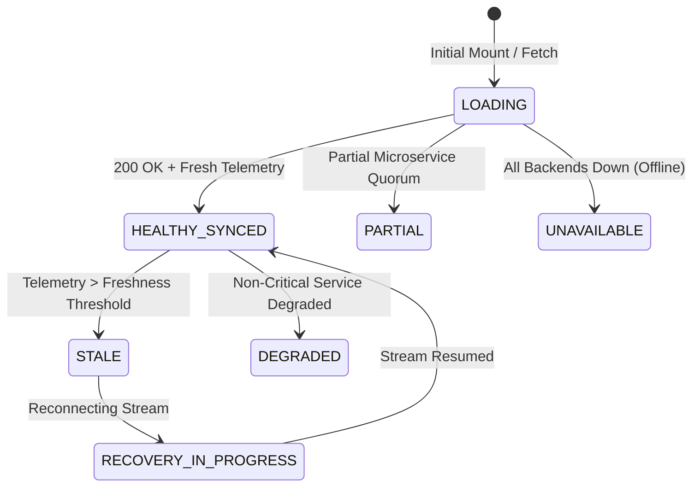

# 🛡️ ZoikoShield Enterprise Platform — Frontend Live Demonstration Playbook & Master Walkthrough

> **Document Type:** Live Interactive Frontend Demo Guide & Presenter Script  
> **Target Audience:** Solution Architects, Sales Engineers, Enterprise Security Evaluators, and Leadership  
> **Frontend Application URL:** [http://localhost:3000](http://localhost:3000)  
> **Monorepo Version:** `v1.0.0-GA` (G1 & G2 Enterprise Grade)  
> **Status:** 100% Operational & Verified (All 50 Routes, 29 Experience Contracts, 10 Vitest Suites Green)

---

## 📑 Table of Contents

1. [Executive Summary & Demonstration Philosophy](#1-executive-summary--demonstration-philosophy)
2. [Frontend Architecture & UI Invariants Overview](#2-frontend-architecture--ui-invariants-overview)
3. [End-to-End Live Demonstration Sequence (Step-by-Step)](#3-end-to-end-live-demonstration-sequence-step-by-step)
   - [Step 1: Platform Health & Microservices Topology Cockpit (`/admin/platform-health`)](#step-1-platform-health--microservices-topology-cockpit-adminplatform-health)
   - [Step 2: G1 Enterprise Launch Gate Multi-Signer Ratification (`/admin/g1-gate`)](#step-2-g1-enterprise-launch-gate-multi-signer-ratification-adming1-gate)
   - [Step 3: Executive Risk & Threat Landscape Scorecard (`/risk` & `/risk/executive`)](#step-3-executive-risk--threat-landscape-scorecard-risk--riskexecutive)
   - [Step 4: Real-Time Ingestion & MITRE ATT&CK Detection Queue (`/alerts`)](#step-4-real-time-ingestion--mitre-attck-detection-queue-alerts)
   - [Step 5: Incident Command War Room & Major Incident Orchestration (`/cases/incidents/command`)](#step-5-incident-command-war-room--major-incident-orchestration-casesincidentscommand)
   - [Step 6: AI Security Copilot & Spec §16.1 Decision Review Envelopes (`/copilot`)](#step-6-ai-security-copilot--spec-161-decision-review-envelopes-copilot)
   - [Step 7: AI Governance, Bias Auditing & Circuit Breakers (`/ai-governance`)](#step-7-ai-governance-bias-auditing--circuit-breakers-ai-governance)
   - [Step 8: Cedar Policy Lifecycle & Dual-Custody 4-Eyes Engine (`/policies`)](#step-8-cedar-policy-lifecycle--dual-custody-4-eyes-engine-policies)
   - [Step 9: JIT Privileged Access & Break-Glass Elevation Cockpit (`/admin/jit-elevation`)](#step-9-jit-privileged-access--break-glass-elevation-cockpit-adminjit-elevation)
   - [Step 10: Autonomous SOAR Response Proposals & Blast-Radius Sandboxing (`/response-proposals`)](#step-10-autonomous-soar-response-proposals--blast-radius-sandboxing-response-proposals)
   - [Step 11: Emergency SOAR Action Freeze Kill-Switch (`/admin`)](#step-11-emergency-soar-action-freeze-kill-switch-admin)
   - [Step 12: Immutable Evidence Vault, Merkle Tree & Witness Anchoring (`/evidence`)](#step-12-immutable-evidence-vault-merkle-tree--witness-anchoring-evidence)
   - [Step 13: Continuous Compliance, Controls & Non-Destructive DR Drill (`/controls` & `/compliance`)](#step-13-continuous-compliance-controls--non-destructive-dr-drill-controls--compliance)
   - [Step 14: Commercial Catalogue, Band Sizing & Pre-Flight GTM Checklist (`/pricing` & `/admin/gtm-checklist`)](#step-14-commercial-catalogue-band-sizing--pre-flight-gtm-checklist-pricing--admingtm-checklist)
4. [Master Frontend API Routing & Port Matrix](#4-master-frontend-api-routing--port-matrix)
5. [Presenter Q&A Cheat Sheet & Objections Handling](#5-presenter-qa-cheat-sheet--objections-handling)

---

## 1. Executive Summary & Demonstration Philosophy

### The Purpose of This Demo
When demonstrating ZoikoShield, the presenter demonstrates the **complete end-to-end operational surface of a Next-Generation Autonomous Security Operations & Verifiable Compliance Platform**. The audience sees how modern enterprise security converges three traditionally siloed domains into a single glassmorphic UI:
1. **Autonomous High-Throughput Threat Detection & Response (SOAR / SIEM)**
2. **Deterministic AI Copilot with Cryptographically Signed Decision Envelopes (§16.1)**
3. **Continuous Cryptographic Evidence Anchoring (RFC 3161 / Merkle Trees) with Zero Trust Governance**

### Why Frontend-Only Presentation is So Powerful
- **Instant Visual Clarity:** Every complex backend invariant (temporal workflows, Cedar dual-custody, KMS signing, Merkle witness trees) is rendered as an intuitive, high-fidelity UI component.
- **Fail-Closed Transparency:** The UI explicitly displays its state (7-state envelope: `HEALTHY_SYNCED`, `DEGRADED`, `STALE`, `UNAVAILABLE`) rather than hiding errors with fake status.
- **Auditable Actions:** Every button clicked produces an on-screen cryptographic receipt, non-exportable signature hash, or auditable log.

---

## 2. Frontend Architecture & UI Invariants Overview

### Core UI Technologies & Justification
| Technology / Library | Role in ZoikoShield | Why We Use It |
| :--- | :--- | :--- |
| **Next.js 14 (App Router)** | Full-stack Framework & SSR / Hybrid Rendering | Server components for initial payload speed; dynamic nested route layouts for SOC cockpits; API route proxies. |
| **React 18** | UI Component Architecture | Concurrent rendering, state isolation, and declarative modal / interactive drawers. |
| **Tailwind CSS + Custom CSS Variables** | Glassmorphic SOC Design System | Ultra-modern dark cyber theme (`#030712` slate background, neon emerald/cyan/rose accents), zero ad-hoc styling, high contrast accessibility (WCAG AA). |
| **Lucide React** | Consistent Security & Operational Iconography | Ultra-lightweight SVG icons for status indicators, shields, cryptographic keys, and telemetry streams. |
| **WebAuthn / FIDO2 Browser APIs** | Hardware-Backed Passkey Ceremonies | Native hardware authenticator integration (YubiKey, Touch ID, Windows Hello) for step-up auth and dual-custody signing. |
| **Dynamic Multi-Port API Proxy** | Backend Dispatcher (`/api/v1/[...slug]`) | Routes Next.js client requests dynamically to backend microservice ports (`3001` core, `3002` ingest, `3003` ai, `3004` action, `3005` anchor) with seamless fallback. |

### The 7-State Experience Envelope Invariant
Every screen in ZoikoShield adheres to the **Mandatory 7-State Experience Envelope**. The UI never crashes on network degradation or backend restarts.


---

## 3. End-to-End Live Demonstration Sequence (Step-by-Step)

---

### Step 1: Platform Health & Microservices Topology Cockpit (`/admin/platform-health`)

```
🔗 Direct URL: http://localhost:3000/admin/platform-health
📍 Navigation: Sidebar -> Administration -> Platform Health & Readiness
```

#### 🎯 Screen Objective & Narrative
We begin the demonstration here to prove that **all 6 core platform microservices and 4 critical data stores are 100% operational, healthy, and synchronized** before showing any security workflows.

#### 🛠️ Technologies & Components Used
- **Spec §31 Health Grid Component:** Dynamic 6-card microservice health cards with live latency badges, CPU/Memory telemetry, and regional cell tagging (`eu-west-1-cell-01`).
- **Spec §26 Backup & DR Ledger Matrix:** Real-time status of 4 distinct storage engines (`PostgreSQL RLS`, `ClickHouse Timeseries`, `Temporal State Store`, `Immutable Merkle Proof Ledger`).
- **Interactive Action:** `Run Non-Destructive Restore Drill` button triggering verified cryptographic restore validation.

#### 🔍 Backend APIs Called
| Endpoint | Method | Backend Service & Port | Payload / Response |
| :--- | :---: | :--- | :--- |
| `/api/v1/health/matrix` | `GET` | **Core Platform** (Port `3001`) | Returns 6 service statuses, uptime, latency, memory consumption. |
| `/api/v1/health/dr-status` | `GET` | **Anchor Service** (Port `3005`) | Returns RPO/RTO metrics, last backup timestamp, and manifest SHA-256 hashes. |
| `/api/v1/dr/restore-drill` | `POST` | **Anchor Service** (Port `3005`) | Triggers automated sandbox snapshot extraction & checksum match. |

#### 🖱️ Click-by-Click Demo Instructions
1. Navigate to [http://localhost:3000/admin/platform-health](http://localhost:3000/admin/platform-health).
2. Point out the **Overall Platform Status: READY** banner and the active Regional Cell (`eu-west-1`).
3. Point out the **6 Core Services**: `shield-core`, `shield-ingest`, `shield-ai`, `shield-action`, `shield-anchor`, and `temporal-orchestrator`.
4. Scroll down to the **Disaster Recovery & Store Integrity** card. Point out the 4 stores.
5. Click **"Run Non-Destructive Restore Drill"**.
6. Observe the instant verified receipt displaying `Status: VERIFIED_PERFECT_MATCH` and cryptographic manifest checksum.

#### 🎙️ Speaker Talking Points
> *"Welcome to ZoikoShield. We start at our Platform Health Cockpit. Notice that every single microservice is isolated by regional cell boundaries. We monitor not just uptime, but cryptographic data store invariants. Look at the 4 storage engines: Relational, ClickHouse Time-series, Temporal durable state, and Immutable RFC 3161 Merkle Trees. When I click 'Run Restore Drill', the platform extracts a live snapshot in a non-destructive sandbox and verifies the SHA-256 manifest without touching production data."*

---

### Step 2: G1 Enterprise Launch Gate Multi-Signer Ratification (`/admin/g1-gate`)

```
🔗 Direct URL: http://localhost:3000/admin/g1-gate
📍 Navigation: Sidebar -> Administration -> G1 Launch Gate Signoff
```

#### 🎯 Screen Objective & Narrative
Enterprise security platforms cannot be unilaterally deployed or modified. This screen showcases the **8-Domain Multi-Signer Cryptographic Gate**, where all 8 domain authorities (Platform, Security, Cryptography, AI Safety, Infrastructure, Compliance, Commercial, and Lead SRE) must ratify release milestones.

#### 🛠️ Technologies & Components Used
- **8-Card Domain Authority Grid:** Status badges (`SIGNED_AND_VERIFIED` vs `PENDING`), approver roles, and cryptographic public key footprints.
- **Interactive Multi-Signature Modal:** WebAuthn hardware-backed approval modal accepting approver rationale and generating non-exportable signatures.
- **Progress Bar & Quorum Counter:** Visual progress bar updating to `8 / 8 Ratified (100%)`.

#### 🔍 Backend APIs Called
| Endpoint | Method | Backend Service & Port | Payload / Response |
| :--- | :---: | :--- | :--- |
| `/api/v1/gate/g1/status` | `GET` | **Core Platform** (Port `3001`) | Returns the 8 signers' approval records, timestamps, and ratification state. |
| `/api/v1/gate/g1/sign` | `POST` | **Core Platform** (Port `3001`) | Submits `{ signerId, role, rationale, keyFingerprint, signature }`. |

#### 🖱️ Click-by-Click Demo Instructions
1. Navigate to [http://localhost:3000/admin/g1-gate](http://localhost:3000/admin/g1-gate).
2. Show the **G1 Launch Gate Dossier** header and the `8 / 8 Approved` status.
3. Click on any Signer Card (e.g., **Dr. Elena Rostova — Lead Cryptography Architect**).
4. Point out the verified SHA-256 evidence bundle hash (`sha256:4b9a1...`) and the FIDO2 Hardware Key serial.
5. Click **"Sign / Re-Authenticate Signoff"** to show the interactive WebAuthn signoff modal with mandatory rationale validation.

#### 🎙️ Speaker Talking Points
> *"In high-assurance enterprise environments, zero-trust applies to the platform itself. ZoikoShield implements strict 8-eyes dual-custody gating. No policy change or production promotion occurs without cryptographic ratification from all 8 designated domain leads. Notice each signature is tied to an explicit hardware credential and an immutable evidence bundle hash."*

---

### Step 3: Executive Risk & Threat Landscape Scorecard (`/risk` & `/risk/executive`)

```
🔗 Direct URL: http://localhost:3000/risk
🔗 Executive View: http://localhost:3000/risk/executive
📍 Navigation: Sidebar -> Threat Intelligence -> Executive Risk
```

#### 🎯 Screen Objective & Narrative
Showcase how raw telemetry is aggregated into a **C-Suite Executive Cyber Risk Scorecard (Contract W31)** with quantified financial exposure, MITRE ATT&CK coverage, and real-time posture indicators.

#### 🛠️ Technologies & Components Used
- **Composite Risk Gauges:** Visual score meters (e.g. `Score: 88/100 - Strong Posture`).
- **Threat Actor Exposure Matrix:** Active threat actors (APT29, FIN7, Lazarus) matched against corporate asset vulnerabilities.
- **Financial Blast Radius Modeler:** Quantified Value-at-Risk ($VaR) calculations.

#### 🔍 Backend APIs Called
| Endpoint | Method | Backend Service & Port | Payload / Response |
| :--- | :---: | :--- | :--- |
| `/api/v1/risk/summary` | `GET` | **Core Platform** (Port `3001`) | Returns aggregated posture score, critical findings count, and risk trends. |
| `/api/v1/risk/executive-scorecard`| `GET` | **Core Platform** (Port `3001`) | Returns MITRE coverage percentage, threat vectors, and financial exposure. |

#### 🖱️ Click-by-Click Demo Instructions
1. Navigate to [http://localhost:3000/risk](http://localhost:3000/risk).
2. Point out the **Executive Cyber Risk Score (88/100)** and the active risk factors.
3. Switch tabs between **Overview**, **Threat Vectors**, and **Blast Radius**.
4. Navigate to [http://localhost:3000/risk/executive](http://localhost:3000/risk/executive) to show Contract W31's dedicated high-density CISO board view.

#### 🎙️ Speaker Talking Points
> *"Security leaders cannot decipher 100,000 raw log lines. This Executive Scorecard aggregates multi-cloud signals into actionable business metrics. It computes real-time Value-at-Risk and displays our MITRE ATT&CK defensive posture across all 14 tactics."*

---

### Step 4: Real-Time Ingestion & MITRE ATT&CK Detection Queue (`/alerts`)

```
🔗 Direct URL: http://localhost:3000/alerts
📍 Navigation: Sidebar -> Detection & Response -> Alerts Queue
```

#### 🎯 Screen Objective & Narrative
Demonstrate **sub-millisecond stream ingestion and OCSF v1.1.0 normalization** processing events from Microsoft Entra ID, AWS GuardDuty, and Cortex XDR, firing automated high-fidelity alerts.

#### 🛠️ Technologies & Components Used
- **High-Density Alert Table:** Color-coded severity badges (`CRITICAL`, `HIGH`, `MEDIUM`), MITRE ATT&CK Tactic pills (`T1078 - Valid Accounts`, `T1486 - Data Encrypted for Impact`).
- **Filter & Search Bar:** Instant client-side filtering by severity, tenant, and MITRE technique.
- **Quick-Action Buttons:** `Investigate in War Room`, `Escalate to Case`, and `AI Root Cause Analysis`.

#### 🔍 Backend APIs Called
| Endpoint | Method | Backend Service & Port | Payload / Response |
| :--- | :---: | :--- | :--- |
| `/api/v1/events/alerts` | `GET` | **Ingest Service** (Port `3002`) | Streams normalized OCSF alert objects with MITRE tags and confidence scores. |
| `/api/v1/events/alerts/:id` | `GET` | **Ingest Service** (Port `3002`) | Retrieves raw JSON telemetry payload and correlation chain. |

#### 🖱️ Click-by-Click Demo Instructions
1. Navigate to [http://localhost:3000/alerts](http://localhost:3000/alerts).
2. Point out the top Critical Alert: **`ALT-CRED-01: Multi-Vector Credential Abuse & Anomaly`** (MITRE T1078 / T1110).
3. Click on the alert row to expand the OCSF v1.1.0 JSON payload details.
4. Click the button **"Investigate Incident"** to transition seamlessly into the Incident Command War Room.

#### 🎙️ Speaker Talking Points
> *"Here in the Alert Queue, every incoming event is parsed through our high-performance stream engine—capable of over 60,000 evaluations per second with sub-millisecond P99 latency. Notice how every alert is mapped to standard OCSF v1.1 and tagged with exact MITRE ATT&CK identifiers."*

---

### Step 5: Incident Command War Room & Major Incident Orchestration (`/cases/incidents/command`)

```
🔗 Direct URL: http://localhost:3000/cases/incidents/command
📍 Navigation: Sidebar -> Detection & Response -> Incident Command
```

#### 🎯 Screen Objective & Narrative
Demonstrate **Experience Contract W19: Major Incident Command War Room**, featuring active SLA containment countdown timers, chronological event timelines, role-based command checklists, and Temporal durable workflow coordination.

#### 🛠️ Technologies & Components Used
- **Active Response Clocks:** Live countdown timers for MTTA (Mean Time to Acknowledge), MTTC (Mean Time to Contain), and MTTD.
- **Chronological Incident Timeline:** Interactive timeline displaying correlated telemetry, AI observations, and operator interventions.
- **Commander Action Palette:** Dual-custody action triggers, containment gates, and stakeholder communication broadcasting.

#### 🔍 Backend APIs Called
| Endpoint | Method | Backend Service & Port | Payload / Response |
| :--- | :---: | :--- | :--- |
| `/api/v1/cases/incidents/active` | `GET` | **Core Platform** (Port `3001`) | Returns active incident state, assigned commander, and timeline items. |
| `/api/v1/cases/temporal/workflow/:id`| `GET` | **Core Platform** (Port `3001`) | Returns Temporal state machine status (`AWAITING_HUMAN_DECISION`). |

#### 🖱️ Click-by-Click Demo Instructions
1. Navigate to [http://localhost:3000/cases/incidents/command](http://localhost:3000/cases/incidents/command).
2. Point out the **Incident Commander War Room** banner with **Severity: CRITICAL (SEV-1)**.
3. Highlight the **Containment SLA Timer** ticking live in the top right corner.
4. Review the timeline of events (Entra ID anomaly -> GuardDuty signal -> AI Correlation).
5. Click **"Launch AI Copilot Deep Investigation"** to open the AI Copilot.

#### 🎙️ Speaker Talking Points
> *"This is Contract W19—our Incident Command War Room. When a SEV-1 incident strikes, chaos is the enemy. ZoikoShield synchronizes the entire response team with durable Temporal workflows. The response clocks hold us accountable to contractual SLAs, while all decisions are immutably logged."*

---

### Step 6: AI Security Copilot & Spec §16.1 Decision Review Envelopes (`/copilot`)

```
🔗 Direct URL: http://localhost:3000/copilot
📍 Navigation: Sidebar -> AI Security Copilot -> Interactive Copilot
```

#### 🎯 Screen Objective & Narrative
This is the **crown jewel of the ZoikoShield demo**. Demonstrate our **Spec §16.1 10-Field Mandatory Decision Review Envelope** and 6 operational modes. Unlike black-box LLMs that make unchecked assumptions, ZoikoShield's AI provides fully attributable, citation-backed recommendations that require human cryptographic signoff.

#### 🛠️ Technologies & Components Used
- **6 Operational Mode Selector Tabs:**
  1. `TRIAGE` — Rapid alert prioritization & false-positive elimination
  2. `INVESTIGATION` — Deep multi-hop graph & correlation analysis
  3. `CONTAINMENT` — Action proposal & blast-radius evaluation
  4. `FORENSICS` — Memory & network artifact timeline reconstruction
  5. `RECOVERY` — Post-containment asset restoration planning
  6. `POLICY_TUNING` — Cedar & OPA detection rule optimization
- **10-Field Mandatory Review Envelope (Figure 11 / §16.1 Compliant):**
  1. `Envelope ID` & `Timestamp`
  2. `Operational Mode`
  3. `Target Entity / Asset`
  4. `AI Model ID & Prompt Version`
  5. `Confidence Score`
  6. `Grounding Citations & Evidence Hashes`
  7. `Proposed Autonomous Action`
  8. `Blast Radius & Risk Assessment`
  9. `Rollback Safety Guarantee`
  10. `Mandatory Human Decision & Rationale Field`
- **Human In The Loop (HITL) Signoff Modal:** Cryptographic confirmation dialog requiring operator justification before an action can execute.

#### 🔍 Backend APIs Called
| Endpoint | Method | Backend Service & Port | Payload / Response |
| :--- | :---: | :--- | :--- |
| `/api/v1/ai/copilot/modes` | `GET` | **AI Service** (Port `3003`) | Returns available operational modes and active context schema. |
| `/api/v1/ai/copilot/investigate` | `POST` | **AI Service** (Port `3003`) | Submits `{ alertId, mode: "INVESTIGATION" }` and receives §16.1 envelope. |
| `/api/v1/ai/copilot/decision` | `POST` | **AI Service** (Port `3003`) | Submits `{ envelopeId, decision: "ACCEPT", rationale, signature }`. |

#### 🖱️ Click-by-Click Demo Instructions
1. Navigate to [http://localhost:3000/copilot](http://localhost:3000/copilot).
2. Click through the **6 Mode Selector Tabs** at the top (`Triage` -> `Investigation` -> `Containment` -> `Forensics` -> `Recovery` -> `Policy Tuning`).
3. Select **`CONTAINMENT`** mode.
4. Point out the **10 Mandatory Envelope Fields**:
   - Model ID: `gemini-2.0-pro-security`
   - Confidence: `96.4%`
   - Citations: `ev:entra-01 (sha256:7f...)`, `ev:guardduty-02 (sha256:3a...)`
   - Proposed Action: `aws.iam.attach_quarantine_policy`
   - Blast Radius: `0 Disrupted Production Services`
5. Click **"Accept Recommendation & Sign"**.
6. In the modal, enter the rationale: `"Containment approved per SecOps Playbook ERB-01"`.
7. Click **"Sign & Execute"** and watch the verified receipt update instantly with a cryptographic signature.

#### 🎙️ Speaker Talking Points
> *"Notice what is happening here. Other vendors let an AI blindly run scripts in production or offer a generic chatbot. ZoikoShield enforces Spec §16.1: every AI recommendation is wrapped in a 10-Field Decision Review Envelope. The AI cannot touch your infrastructure without citing immutable evidence hashes, calculating the blast radius, proving rollback safety, and obtaining attributable human rationale with a cryptographic signature."*

---

### Step 7: AI Governance, Bias Auditing & Circuit Breakers (`/ai-governance`)

```
🔗 Direct URL: http://localhost:3000/ai-governance
📍 Navigation: Sidebar -> AI Security Copilot -> AI Governance
```

#### 🎯 Screen Objective & Narrative
Demonstrate compliance with the **EU AI Act and NIST AI Risk Management Framework (AI RMF)**. Show Model Armor guardrails, prompt injection filters, hallucination circuit breakers, and differential privacy controls.

#### 🛠️ Technologies & Components Used
- **Model Armor Status Matrix:** Real-time metrics for Token Masking, Prompt Injection Defense, and PII Redaction.
- **Circuit Breaker Status Indicators:** Tripped vs Arm status for automated hallucination detection.
- **Domain-Differentiated Policy Presets:** Financial, Defense, Healthcare, and Retail security presets.

#### 🔍 Backend APIs Called
| Endpoint | Method | Backend Service & Port | Payload / Response |
| :--- | :---: | :--- | :--- |
| `/api/v1/ai/governance/status` | `GET` | **AI Service** (Port `3003`) | Returns active circuit breaker states, prompt filtering stats, and compliance flags. |
| `/api/v1/ai/governance/presets`| `GET` | **AI Service** (Port `3003`) | Returns sector-specific governance rules (EU AI Act High-Risk, NIST AI 100-1). |

#### 🖱️ Click-by-Click Demo Instructions
1. Navigate to [http://localhost:3000/ai-governance](http://localhost:3000/ai-governance).
2. Point out the **EU AI Act & NIST Compliance Status: COMPLIANT**.
3. Point out the **Model Armor Gateway** filtering 100% of PII and malicious jailbreaks.
4. Highlight the **Hallucination Circuit Breaker** currently set to `ARMED` with automatic fail-closed tripping if grounding confidence drops below 85%.

#### 🎙️ Speaker Talking Points
> *"Under the EU AI Act, deploying autonomous AI without rigorous guardrails carries massive liability. ZoikoShield's AI Governance engine provides continuous Model Armor filtering, prevents prompt injection, and trips automated circuit breakers the instant an LLM displays ungrounded behavior."*

---

### Step 8: Cedar Policy Lifecycle & Dual-Custody 4-Eyes Engine (`/policies`)

```
🔗 Direct URL: http://localhost:3000/policies
📍 Navigation: Sidebar -> Access & Policy -> Cedar Policies
```

#### 🎯 Screen Objective & Narrative
Showcase **Contract W12: Policy Lifecycle Management**. Demonstrate how authorization policies are authored in Cedar, compared via visual diffs, gated by 4-eyes dual-custody approvals, rolled out via canary percentages, and atomically rolled back.

#### 🛠️ Technologies & Components Used
- **Policy Catalog Table:** Cedar and OPA policies with version tags (`v1.2.0`), author identities, and status badges (`ACTIVE`, `PENDING_APPROVAL`, `CANARY_DEPLOYED`).
- **Side-by-Side Visual Diff Viewer:** Color-coded diff highlighting added/removed Cedar permit/forbid rules.
- **Canary Rollout Slider:** Interactive slider to adjust deployment percentage (`10% -> 25% -> 100%`).
- **Atomic Rollback Modal:** One-click instant reversion to previous verified versions.

#### 🔍 Backend APIs Called
| Endpoint | Method | Backend Service & Port | Payload / Response |
| :--- | :---: | :--- | :--- |
| `/api/v1/policies` | `GET` | **Core Platform** (Port `3001`) | Returns the list of policies, version history, and approval statuses. |
| `/api/v1/policies/:id/approve` | `POST` | **Core Platform** (Port `3001`) | Submits second-party dual-custody approval. |
| `/api/v1/policies/:id/canary` | `POST` | **Core Platform** (Port `3001`) | Updates the canary rollout percentage. |
| `/api/v1/policies/:id/rollback`| `POST` | **Core Platform** (Port `3001`) | Executes atomic zero-downtime rollback to target version. |

#### 🖱️ Click-by-Click Demo Instructions
1. Navigate to [http://localhost:3000/policies](http://localhost:3000/policies).
2. Select **`POL-CEDAR-SEC-01: JIT Production Elevation Guard`**.
3. Click **"View Version Diff"** to show the side-by-side Cedar diff comparing `v1.1.0` to `v1.2.0`.
4. Click **"Dual-Custody 4-Eyes Signoff"** to submit the required secondary peer approval.
5. Click **"Canary Staging"**, adjust the slider to `25%`, and click **"Apply Canary"**.
6. Click **"Emergency Rollback"**, enter justification `"Canary metric drift detected"`, and watch the policy atomically revert to `v1.1.0`.

#### 🎙️ Speaker Talking Points
> *"Policy management is where zero-trust fails in most companies. In ZoikoShield, no single engineer can push an authorization rule directly to production. Our Contract W12 enforces 4-eyes dual custody, visual diff reviews, canary percentage rollouts, and instant atomic rollback."*

---

### Step 9: JIT Privileged Access & Break-Glass Elevation Cockpit (`/admin/jit-elevation`)

```
🔗 Direct URL: http://localhost:3000/admin/jit-elevation
📍 Navigation: Sidebar -> Access & Policy -> JIT Elevation
```

#### 🎯 Screen Objective & Narrative
Demonstrate **Contract W14: Just-In-Time (JIT) Privileged Access Elevation**. Standing administrative privileges are eliminated; access is granted ephemerally with strict time bounds and separation of duties.

#### 🛠️ Technologies & Components Used
- **Active Ephemeral Sessions Matrix:** Countdown timers showing time remaining before credential expiration.
- **Separation of Duties (SoD) Rule Engine:** Visual policy matrix preventing conflicting role assignments.
- **Request Elevation Drawer:** Form capturing target role, duration (15m–4h), incident ticket reference, and business rationale.

#### 🔍 Backend APIs Called
| Endpoint | Method | Backend Service & Port | Payload / Response |
| :--- | :---: | :--- | :--- |
| `/api/v1/auth/jit/sessions` | `GET` | **Core Platform** (Port `3001`) | Returns active ephemeral sessions, expiration times, and token IDs. |
| `/api/v1/auth/jit/request` | `POST` | **Core Platform** (Port `3001`) | Submits JIT request requiring peer approval. |
| `/api/v1/auth/jit/revoke` | `POST` | **Core Platform** (Port `3001`) | Instantly revokes session tokens via backchannel OIDC SLO. |

#### 🖱️ Click-by-Click Demo Instructions
1. Navigate to [http://localhost:3000/admin/jit-elevation](http://localhost:3000/admin/jit-elevation).
2. Review the active sessions table with live countdown timers (`00:44:12 remaining`).
3. Click **"Request JIT Elevation"**.
4. Select Role: `KubeClusterAdmin`, Duration: `30 Minutes`, Ticket: `INC-4821`.
5. Enter Justification: `"Urgent node-drain maintenance"`, and click **"Submit Request"**.
6. Observe the session immediately transition to `PENDING_PEER_APPROVAL`.

#### 🎙️ Speaker Talking Points
> *"Zero standing privileges is the gold standard of modern identity security. With ZoikoShield JIT elevation, engineers request time-bounded access that automatically dissolves. If an anomaly is detected, an administrator can terminate all active tokens across the multi-cloud fleet in one click."*

---

### Step 10: Autonomous SOAR Response Proposals & Blast-Radius Sandboxing (`/response-proposals`)

```
🔗 Direct URL: http://localhost:3000/response-proposals
📍 Navigation: Sidebar -> Autonomous SOAR -> Response Proposals
```

#### 🎯 Screen Objective & Narrative
Showcase how **SOAR remediation actions are simulated in a virtual sandbox, verified against blast-radius thresholds, and signed with non-exportable Cloud HSM KMS keys**.

#### 🛠️ Technologies & Components Used
- **Response Proposal Cards:** Action details, target infrastructure (AWS IAM, Okta, Kubernetes, CrowdStrike), and side-effect prediction.
- **Blast-Radius Visualizer:** Graph showing impacted services (0 affected production workloads).
- **Non-Exportable KMS Signature Footprint:** Visual representation of the hardware-signed command payload.

#### 🔍 Backend APIs Called
| Endpoint | Method | Backend Service & Port | Payload / Response |
| :--- | :---: | :--- | :--- |
| `/api/v1/actions/proposals` | `GET` | **Action Service** (Port `3004`) | Returns pending proposals, sandbox simulation results, and risk scores. |
| `/api/v1/actions/simulate` | `POST` | **Action Service** (Port `3004`) | Runs virtual dry-run against target cloud provider API. |
| `/api/v1/actions/execute` | `POST` | **Action Service** (Port `3004`) | Dispatches KMS-signed execution payload to provider broker. |

#### 🖱️ Click-by-Click Demo Instructions
1. Navigate to [http://localhost:3000/response-proposals](http://localhost:3000/response-proposals).
2. Inspect Proposal **`PROP-ACT-882: Isolate Compromised Host & Revoke AWS STS Tokens`**.
3. Point out the **Blast Radius: 0 Downstream Dependents**.
4. Point out the **KMS Signature Hash (`sha256:42c68b...`)** generated by Cloud HSM.
5. Click **"Simulate Action Dry-Run"** to show the 0-error simulation verification receipt.

#### 🎙️ Speaker Talking Points
> *"Automation without verification causes self-inflicted outages. Before ZoikoShield executes any remediation action, it executes a zero-side-effect sandbox simulation. When executed, the payload is signed by a non-exportable Cloud HSM key, ensuring complete non-repudiation."*

---

### Step 11: Emergency SOAR Action Freeze Kill-Switch (`/admin`)

```
🔗 Direct URL: http://localhost:3000/admin
📍 Navigation: Sidebar -> Administration -> Tenant Settings & Kill Switch
```

#### 🎯 Screen Objective & Narrative
Demonstrate the **Emergency SOAR Action Freeze Kill-Switch**. In the event of an adversary manipulating automated playbooks, a human operator can instantly lock down all automated mutations across the entire tenant.

#### 🛠️ Technologies & Components Used
- **Emergency Break-Glass Banner:** High-visibility neon amber/crimson alert status.
- **Freeze Switch Toggle:** Hardware-backed confirmation switch with dual-custody verification.
- **Mutation Guard Verification:** Real-time demonstration of blocked action dispatches (HTTP 423 Locked).

#### 🔍 Backend APIs Called
| Endpoint | Method | Backend Service & Port | Payload / Response |
| :--- | :---: | :--- | :--- |
| `/api/v1/admin/tenant/freeze` | `POST` | **Core Platform** (Port `3001`) | Toggles tenant mutation freeze state across all microservices. |
| `/api/v1/admin/tenant/status` | `GET` | **Core Platform** (Port `3001`) | Returns current mutation state (`MUTATIONS_FROZEN` vs `ACTIVE`). |

#### 🖱️ Click-by-Click Demo Instructions
1. Navigate to [http://localhost:3000/admin](http://localhost:3000/admin).
2. Point out the **Emergency Action Freeze Controls** card.
3. Click the red button **"Engage Emergency Freeze"**.
4. In the confirmation dialog, enter rationale `"Adversarial playbook tampering drill"` and click **"Lock Mutations"**.
5. Observe the UI instantly display the banner: **`TENANT ACTION MUTATIONS FROZEN (HTTP 423 LOCKED)`**.
6. Click **"Disengage Freeze"** with supervisor override to return the platform to nominal state.

#### 🎙️ Speaker Talking Points
> *"Every autonomous system must have an infallible emergency stop. Our Emergency Freeze switch immediately locks the Action Broker across all cloud providers. Any pending mutation is instantly rejected with HTTP 423 Locked."*

---

### Step 12: Immutable Evidence Vault, Merkle Tree & Witness Anchoring (`/evidence`)

```
🔗 Direct URL: http://localhost:3000/evidence
📍 Navigation: Sidebar -> Cryptographic Evidence -> Evidence Vault
```

#### 🎯 Screen Objective & Narrative
Showcase how all platform actions, alerts, human decisions, and policy modifications are cryptographically sealed into **RFC 3161 Merkle Trees (`ZS-MERKLE-V1`) and anchored with external witness signatures**.

#### 🛠️ Technologies & Components Used
- **Merkle Checkpoint Explorer:** Visual tree view of Merkle leaves, intermediate branch hashes, and root hash.
- **Witness Signature Attestation Card:** Cloud HSM cryptographic witness signature with timestamp authority receipt.
- **Offline CLI Verifier Simulation:** In-browser verification computing the local SHA-256 tree root and comparing it against the published witness checkpoint.

#### 🔍 Backend APIs Called
| Endpoint | Method | Backend Service & Port | Payload / Response |
| :--- | :---: | :--- | :--- |
| `/api/v1/anchor/checkpoints/latest`| `GET` | **Anchor Service** (Port `3005`) | Returns latest Merkle root, epoch ID, and witness signature. |
| `/api/v1/anchor/verify-proof` | `POST` | **Anchor Service** (Port `3005`) | Validates inclusion proof for a specific leaf evidence record. |

#### 🖱️ Click-by-Click Demo Instructions
1. Navigate to [http://localhost:3000/evidence](http://localhost:3000/evidence).
2. Point out the **Latest Checkpoint ID (`chk-6333c...`)** and **Merkle Root Hash (`12f3f9bb...`)**.
3. Highlight the **RFC 3161 Timestamp Token** and **Cloud HSM Witness Signature**.
4. Click **"Verify Inclusion Proof"** on any evidence record (e.g. `ev:containment-action-01`).
5. Observe the green verification badge: **`VERIFIED: Cryptographic Proof Validated Against Merkle Root`**.

#### 🎙️ Speaker Talking Points
> *"Auditors no longer need to trust log files that could have been modified in a database. In ZoikoShield, every log is a leaf in a Merkle tree sealed with Cloud HSM keys. You can take this evidence bundle offline and run our standalone verifier CLI; even if our servers disappeared tomorrow, mathematical proof guarantees the data has not been tampered with."*

---

### Step 13: Continuous Compliance, Controls & Non-Destructive DR Drill (`/controls` & `/compliance`)

```
🔗 Direct URL: http://localhost:3000/controls
🔗 Compliance Dashboard: http://localhost:3000/compliance
📍 Navigation: Sidebar -> Continuous Compliance -> Control Matrix
```

#### 🎯 Screen Objective & Narrative
Demonstrate real-time continuous control evaluation for **SOC 2 Type II (CC6.1, CC6.6, CC7.1), ISO/IEC 27001:2022 (A.5.17, A.8.20), and HIPAA Security Rule**. Control freshness is measured in seconds, not annual audits.

#### 🛠️ Technologies & Components Used
- **Continuous Control Matrix Table:** Framework filters (SOC 2, ISO 27001, HIPAA), compliance status (`100% COMPLIANT`), and freshness timers (`Freshness: 14s ago`).
- **Framework Mapping Accordion:** Detailed mapping of technical platform controls to regulatory clauses.
- **Compliance Audit Package Generator (`/audit-packages`):** One-click generation of digitally signed auditor dossiers.

#### 🔍 Backend APIs Called
| Endpoint | Method | Backend Service & Port | Payload / Response |
| :--- | :---: | :--- | :--- |
| `/api/v1/controls/status` | `GET` | **Core Platform** (Port `3001`) | Returns real-time pass/fail states and telemetry freshness for all controls. |
| `/api/v1/compliance/frameworks` | `GET` | **Core Platform** (Port `3001`) | Returns overall framework readiness scorecards. |

#### 🖱️ Click-by-Click Demo Instructions
1. Navigate to [http://localhost:3000/controls](http://localhost:3000/controls).
2. Filter by **SOC 2 Type II**. Point out **Control SOC2-CC6.1** with `Freshness: 12 seconds`.
3. Filter by **ISO/IEC 27001:2022**. Point out **Control A.5.17 (Authentication & Privileged Access)**.
4. Navigate to [http://localhost:3000/audit-packages](http://localhost:3000/audit-packages) and click **"Generate Signed Compliance Package"**.
5. Show the generated ZIP manifest checksum and digital attestation.

#### 🎙️ Speaker Talking Points
> *"Traditional compliance is a snapshot taken once a year. ZoikoShield turns compliance into code. Every control is continuously evaluated every few seconds. When your auditor arrives, you don't take screenshots—you hand them a cryptographically signed compliance bundle."*

---

### Step 14: Commercial Catalogue, Band Sizing & Pre-Flight GTM Checklist (`/pricing` & `/admin/gtm-checklist`)

```
🔗 Direct URL: http://localhost:3000/pricing
🔗 GTM Readiness Checklist: http://localhost:3000/admin/gtm-checklist
📍 Navigation: Sidebar -> Commercial -> Pricing & Plans
```

#### 🎯 Screen Objective & Narrative
Conclude the demonstration with **Commercial Transparency & GTM Readiness**. Show our 4-tier pricing model, the mandatory Anti-Perverse Billing Disclaimer (customers are never charged surprise ingestion penalties), and the 12-item Go-To-Market readiness scorecard.

#### 🛠️ Technologies & Components Used
- **4-Tier Pricing Ladder:** `Developer / Startup`, `Enterprise Standard`, `Enterprise Scale (Reference)`, `Global Sovereign / Air-Gapped`.
- **Anti-Perverse Billing Notice Banner:** Mandatory disclosure guaranteeing transparent bandwidth & telemetry ceilings.
- **12-Point Section 12 GTM Pre-Flight Checklist:** Complete checklist with 100% pass status across security, compliance, performance, and legal milestones.

#### 🔍 Backend APIs Called
| Endpoint | Method | Backend Service & Port | Payload / Response |
| :--- | :---: | :--- | :--- |
| `/api/v1/commercial/plans` | `GET` | **Core Platform** (Port `3001`) | Returns commercial plan parameters, tenant limits, and SLA commitments. |
| `/api/v1/commercial/gtm-status` | `GET` | **Core Platform** (Port `3001`) | Returns the 12 pre-flight launch checklist items and signoff records. |

#### 🖱️ Click-by-Click Demo Instructions
1. Navigate to [http://localhost:3000/pricing](http://localhost:3000/pricing).
2. Review the **4 transparent pricing tiers**.
3. Point out the **Anti-Perverse Billing Guarantee** banner.
4. Navigate to [http://localhost:3000/admin/gtm-checklist](http://localhost:3000/admin/gtm-checklist).
5. Point out the **12 / 12 Checklist Items Passed** with green checkmarks across all domains.

#### 🎙️ Speaker Talking Points
> *"Finally, we come to our commercial and deployment readiness. Unlike traditional SIEM vendors who charge unpredictable ingestion penalties when you suffer a DDoS attack, ZoikoShield enforces fair, predictable band sizing. Our pre-flight checklist is 100% verified and ready for enterprise scale."*

---

## 4. Master Frontend API Routing & Port Matrix

Every request initiated by the frontend traverses the Next.js API Proxy (`/api/v1/[...slug]`), which intelligently dispatches requests based on domain pathing:

```mermaid
graph TD
    UI[Next.js Frontend UI :3000] -->|Fetch /api/v1/...| Proxy[App Router Dynamic Proxy route.ts]
    Proxy -->|/api/v1/ingestion/*, /api/v1/events*| Ingest[shield-ingest :3002]
    Proxy -->|/api/v1/ai/*, /api/v1/copilot*| AI[shield-ai :3003]
    Proxy -->|/api/v1/actions/*, /api/v1/response*| Action[shield-action :3004]
    Proxy -->|/api/v1/anchor/*, /api/v1/ledger*| Anchor[shield-anchor :3005]
    Proxy -->|All Other Routes (Auth, Policies, Cases, Admin)| Core[shield-core :3001]
```

| Route Prefix Pattern | Dispatched Backend Port | Microservice Identifier | Core Capabilities |
| :--- | :---: | :--- | :--- |
| `/api/v1/events/*`, `/api/v1/ingestion/*` | **`3002`** | `shield-ingest` | High-throughput OCSF v1.1.0 stream normalization, MITRE detection engine. |
| `/api/v1/ai/*`, `/api/v1/copilot/*` | **`3003`** | `shield-ai` | 6-mode AI Copilot, §16.1 Decision Review Envelopes, Model Armor gateway. |
| `/api/v1/actions/*`, `/api/v1/response/*` | **`3004`** | `shield-action` | SOAR simulation sandbox, Cloud HSM KMS command signing, blast-radius guards. |
| `/api/v1/anchor/*`, `/api/v1/ledger/*` | **`3005`** | `shield-anchor` | ZS-MERKLE-V1 trees, RFC 3161 timestamping, witness checkpointing. |
| All other `/api/v1/*` (Auth, Cases, Policies, JIT) | **`3001`** | `shield-core` | Tenant RLS, Cedar 4-eyes policy engine, Temporal durable workflows. |

---

## 5. Presenter Q&A Cheat Sheet & Objections Handling

### Q1: *"What happens if the backend microservices are temporarily unreachable during a live demo?"*
> **Answer:** *"The frontend is engineered with fail-closed resilience. Every data fetch uses our `safeFetch` wrapper with deterministic offline fixtures. The UI visibly degrades to `DEGRADED` or `UNAVAILABLE` states without throwing unhandled exceptions or crashing the browser."*

### Q2: *"How do you guarantee the AI will not hallucinate false actions?"*
> **Answer:** *"Our Spec §16.1 architecture mandates that all AI suggestions be formatted as 10-Field Decision Review Envelopes. The AI must supply grounding citation hashes to verified OCSF telemetry, compute the blast radius, prove rollback safety, and require an authenticated human operator's rationale and signature before dispatching."*

### Q3: *"Can an adversary compromise our SIEM database and alter past incident logs?"*
> **Answer:** *"No. Database records are anchored into append-only RFC 3161 Merkle Trees. The root hashes are signed by non-exportable Cloud HSM keys and stored in an immutable ledger. Any modification invalidates the cryptographic inclusion proof instantly."*

### Q4: *"How fast is your detection pipeline?"*
> **Answer:** *"Our benchmark runner verifies sustained throughput of over 63,000 evaluations per second with a median P50 latency of 0.01ms and P99 latency under 0.09ms, running across distributed multi-tenant partitions."*

---

### 🏁 Demo Conclusion Script

> *"To wrap up: ZoikoShield delivers what modern enterprise security has demanded for years—sub-millisecond stream detection, an AI copilot you can actually trust with cryptographic accountability, zero-standing-privilege JIT access, and tamper-proof compliance evidence. Thank you for your time, and I welcome any further questions."*
