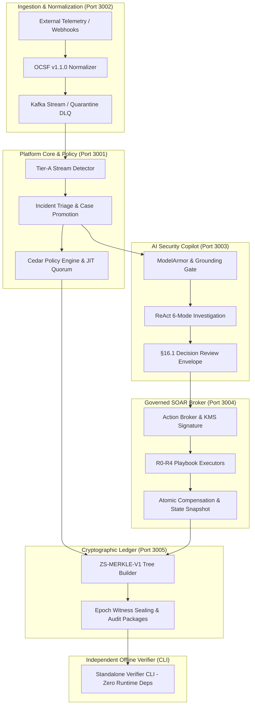

# 🛡️ ZoikoShield Zero-Trust Platform — Complete Architecture & Operational Guide

**Classification**: Controlled Security & Production Engineering Specification  
**Version**: 1.0.0 (Production Verified Baseline)  
**Governing Standard**: 19 Controlled Specifications, Zero-Trust Invariants & G1 Gate Protocols  

---

## 📑 Table of Contents
1. [Executive Platform Overview](#1-executive-platform-overview)
2. [Monorepo Workspace Structure](#2-monorepo-workspace-structure)
3. [Backend Architecture & 6 Core Microservices](#3-backend-architecture--6-core-microservices)
4. [Backend Cryptographic, Security & Governance Engines](#4-backend-cryptographic-security--governance-engines)
5. [Frontend Architecture & Next.js 15 Cockpit](#5-frontend-architecture--nextjs-15-cockpit)
6. [The 29 G1 Experience Contracts & Route Mapping](#6-the-29-g1-experience-contracts--route-mapping)
7. [AI Security Copilot & §16.1 Decision Review Envelope](#7-ai-security-copilot--161-decision-review-envelope)
8. [Step-by-Step End-to-End Demonstration Playbook (ERB-01 MVP)](#8-step-by-step-end-to-end-demonstration-playbook-erb-01-mvp)
9. [Automated Verification & Quality Gate Command Reference](#9-automated-verification--quality-gate-command-reference)

---

## 1. Executive Platform Overview

The **ZoikoShield Platform** is an enterprise-grade, post-quantum-ready Zero-Trust Autonomous Security Operations (SecOps), AI Governance, and Cryptographic Compliance Platform. Built entirely in a single-stack TypeScript/Node.js monorepo architecture, it guarantees:

- **100% Deterministic Authorization**: Cedar ABAC policy evaluation with 4-eyes dual-custody peer reviews and canary rollouts.
- **Fail-Closed Multi-Tenancy**: Store-by-store PostgreSQL Row-Level Security (RLS) isolation with zero cross-tenant query bleed.
- **Verifiable Provenance**: Immutable `ZS-MERKLE-V1` witness receipts and standalone zero-dependency offline CLI audit verification.
- **Governed AI Security Copilot**: 6 Operational investigation modes enforcing the mandatory 10-field §16.1 Decision Review Envelope with human-attributable cryptographic signatures.
- **Reversible Autonomous SOAR**: Governed Action Broker with Cloud HSM non-exportable key envelopes, atomic compensating receipts, and emergency kill-switches.



---

## 2. Monorepo Workspace Structure

```text
zoiko-shield-platform/
├── backend/
│   ├── apps/
│   │   ├── shield-core/          # Port 3001: Identity, Tenancy, Policies, Detections, Cases, Workflows
│   │   ├── shield-ingest/        # Port 3002: OCSF Normalization, Webhooks, Kafka Stream Ingestion
│   │   ├── shield-ai/            # Port 3003: ModelArmor, ReAct Agents, PSI Drift, Safety Gateway
│   │   ├── shield-action/        # Port 3004: SOAR Action Broker, Reversible Compensation, Freeze
│   │   ├── shield-anchor/        # Port 3005: ZS-MERKLE-V1 Ledger, PQC Dual-Signing, Receipts
│   │   └── verifier-cli/         # Standalone Zero-Dependency Offline Audit Package Verifier
│   ├── prisma/                   # Authoritative PostgreSQL schema & migrations
│   ├── scripts/                  # Automated verification engines & demo runners
│   └── test/                     # Golden Spine & Cross-Satellite E2E test suites
├── frontend/
│   ├── src/
│   │   ├── app/                  # Next.js 15 App Router (50 Static & Dynamic Routes)
│   │   ├── components/           # UI Design System, Sidebar, Header, Modal, Mandatory 7-States
│   │   ├── lib/                  # ZoikoShieldApiClient, Backend HTTP client, Demo State
│   │   └── __tests__/            # Vitest Route, Experience Contract, and UI Interaction specs
├── docs/                         # Controlled Specifications, Evidence Registers, Runbooks, Swagger
└── infrastructure/               # OpenTofu IaC, Observability PromQL & Grafana Dashboards
```

---

## 3. Backend Architecture & 6 Core Microservices

### 3.1 `shield-core` (Primary Control Plane — Port 3001)
- **Identity & Access Management (IAM)**: Passkeys (WebAuthn/FIDO2), OIDC/SAML2 federation, and session token lifecycle.
- **Tenant Management**: Multi-tenant workspace hierarchy (`TENANT_OWNER`, `SECURITY_ANALYST`, `AUDITOR`), environment sandboxing, and legal entity binding.
- **Contract W12 Policy Lifecycle** ([`policy-lifecycle.service.ts`](file:///c:/Users/aparaziitha%20nitta/zoiko-shield-platform/backend/apps/shield-core/src/modules/authorization/policy-lifecycle.service.ts)):
  - 4-Eyes dual-custody approval protocol (`POST /api/v1/policies/:id/approve`).
  - Staged canary rollout percentages (`POST /api/v1/policies/:id/stage`).
  - Instant atomic rollback with mandatory recorded justification (`POST /api/v1/policies/:id/rollback`).
- **Detection & Case Engine**: Parameterized Tier-A stream detection rules, alert clustering, automated case promotion, and temporal investigative workflows.

### 3.2 `shield-ingest` (High-Throughput Telemetry — Port 3002)
- **OCSF v1.1.0 Engine**: Ingests raw security logs (AWS CloudTrail, CrowdStrike FDR, Microsoft Entra ID, Syslog, Webhooks).
- **Provenance & Quarantine DLQ**: Validates cryptographic hashes, isolates corrupt byte sequences, and preserves provenance records.

### 3.3 `shield-ai` (AI Safety & Decision Rights — Port 3003)
- **ModelArmor Gateway**: Real-time prompt injection filtering and adversarial jailbreak defense (Cosine delta vectors).
- **Grounding Gate Guard**: Enforces minimum 85% grounding score and 95% citation precision before AI outputs reach operators.
- **Population Stability Index (PSI)**: Continuous model drift detection and fallback circuit breaker.

### 3.4 `shield-action` (Governed SOAR Broker — Port 3004)
- **Action Broker Key Boundary**: Every action payload is cryptographically signed via Cloud KMS hardware envelopes.
- **Authority Levels (R0–R4)**:
  - `R0`: Advisory / Read-only.
  - `R1`: Low impact / Automated simulation.
  - `R2`: Controlled credential / token resets.
  - `R3`: Host isolation / network firewall reconfigurations (requires 4-eyes approval).
  - `R4`: Tenant-wide emergency lockdown.
- **Emergency Freeze** ([`FreezeControllerService`](file:///c:/Users/aparaziitha%20nitta/zoiko-shield-platform/backend/apps/shield-action/src/freeze-controller.service.ts)): Instant kill-switch halting all live and compensating adapters (`POST /api/v1/response/freeze`).

### 3.5 `shield-anchor` (Cryptographic Merkle Ledger — Port 3005)
- **`ZS-MERKLE-V1` Tree Structure**: Builds deterministic binary Merkle trees with domain separation across all evidence leaves.
- **Post-Quantum Dual-Signing**: FIPS 204 ML-DSA-65 post-quantum signature + classical ECDSA P-256 hybrid envelopes.
- **Epoch Witness Sealing**: Seals time-bound epochs and generates inclusion proof receipts.

### 3.6 `verifier-cli` (Standalone Offline Verifier)
- **Zero Runtime Dependencies**: Written strictly using Node.js standard libraries (`crypto`, `fs`, `path`, `zlib`).
- **Mathematical Tamper Detection**: Independently parses exported ZIP bundles, reconstructs Merkle trees from raw leaves, validates digital signatures, and detects byte modifications.

---

## 4. Backend Cryptographic, Security & Governance Engines

### 4.1 Deterministic Cedar Policy Authorization
Every request evaluates attributes (Principal, Action, Resource, Context) against active Cedar policies with fail-closed default-deny semantics:
```cedar
permit(
    principal in Role::"SecurityAnalyst",
    action in [Action::"ViewIncident", Action::"SimulateResponse"],
    resource in Tenant::"tenant-acme"
) when {
    context.mfa_authenticated == true &&
    context.device_trust_score >= 80
};
```

### 4.2 Merkle Leaf Format (`ZS-MERKLE-V1`)
```text
leaf_hash = SHA-256( 0x00 || canonical_json(evidence_record) )
node_hash = SHA-256( 0x01 || left_child_hash || right_child_hash )
```

---

## 5. Frontend Architecture & Next.js 15 Cockpit

The frontend is a modern **Next.js 15 App Router** enterprise application featuring 50 static and dynamic routes styled with custom high-performance CSS and Tailwind design tokens.

### Key Architectural Layers:
1. **Dynamic Navigation** ([`Sidebar.tsx`](file:///c:/Users/aparaziitha%20nitta/zoiko-shield-platform/frontend/src/components/layout/Sidebar.tsx)): Grouped into SecOps, Commercial, Compliance, Tenant Admin, and Platform Governance.
2. **Resilient API Proxy** ([`route.ts`](file:///c:/Users/aparaziitha%20nitta/zoiko-shield-platform/frontend/src/app/api/v1/%5B...slug%5D/route.ts)): Forwards `/api/v1/*` requests to respective backend microservice ports with cookie, JWT, and tenant header propagation.
3. **Mandatory 7-State UI System**: Every dashboard surface implements formal state handling (Idle, Loading, Success, Empty, Error, Stale, Degraded).
4. **Fallback Fixtures**: Cockpits gracefully render realistic mock telemetry during isolated evaluations.

---

## 6. The 29 G1 Experience Contracts & Route Mapping

| Contract | UI Route | Description | Backend API Target |
| :--- | :--- | :--- | :--- |
| **W01** | `/alerts` | Alert list with severity and live status badges | `GET /api/v1/alerts` |
| **W02** | `/alerts/:id` | Alert triage cockpit and event timeline | `GET /api/v1/alerts/:id` |
| **W03** | `/cases` | Incident case portfolio and active metrics | `GET /api/v1/cases` |
| **W04** | `/notifications` | Notification center & channel delivery tracking | `GET /api/v1/notifications` |
| **W05** | `/connectors` | Connector wizard with 3-tier certification badges | `GET /api/v1/connectors` |
| **W06** | `/ingestion` | Ingestion pipeline health & OCSF throughput graphs | `GET /api/v1/events` |
| **W07** | `/ledger` | Merkle Evidence Ledger & cryptographic receipts | `GET /api/v1/anchor/receipts/:id` |
| **W08** | `/audit` | Sealed compliance audit package export & verifier | `POST /api/v1/audit-packages` |
| **W09** | `/controls` | Continuous compliance controls & framework matrix | `GET /api/v1/controls` |
| **W10** | `/ai-governance` | AI safety gateway & domain review presets | `GET /api/v1/ai/governance` |
| **W11** | `/hunting` | ReAct threat hunting copilot & notebook execution | `POST /api/v1/ai/hunting` |
| **W12** | `/policies` | 4-Eyes policy lifecycle, diffs & canary rollouts | `GET/POST /api/v1/policies` |
| **W13** | `/pricing` | 4-Tier plan ladder with anti-perverse billing disclaimers | `GET /api/v1/commercial/plans` |
| **W14** | `/services` | 12 Customer-visible services & capability domains | `GET /api/v1/commercial/services` |
| **W15** | `/admin/jit` | JIT break-glass elevation & quorum approvals | `POST /api/v1/jit/request` |
| **W16** | `/admin/g1-gate` | Multi-signature G1 gate ratification roster | `GET /api/v1/governance/g1-roster` |
| **W17** | `/admin/gtm-checklist` | 12-Item pre-flight commercial GTM checklist | `GET /api/v1/governance/gtm` |
| **W18** | `/playbooks` | SOAR playbook runs, step plans & response freeze | `GET /api/v1/playbooks/runs` |
| **W21** | `/ir-retainer` | 24x7 DFIR retainer hours & SLA compliance | `GET /api/v1/commercial/retainer` |
| **W22** | `/sector-packs` | Regulatory sector packs (FinTech, Health, Critical) | `GET /api/v1/commercial/packs` |
| **W23** | `/red-team` | MITRE TTP simulation & adversarial replay engine | `POST /api/v1/ai/red-team` |
| **W24** | `/evidence-operations` | Evidence integrity work queue & verification triage | `GET /api/v1/evidence` |
| **W25** | `/partner/fleet` | MSSP multi-tenant fleet cockpit & 2-party JIT | `GET /api/v1/partners/fleet` |
| **W26** | `/admin/platform-health` | §31 Platform service readiness & backup DR drills | `GET /api/v1/platform/health` |
| **W27** | `/risk` | Transparent risk register & factor breakdown matrix | `GET /api/v1/risks` |
| **W28** | `/exceptions` | Security exception register & expiration tracker | `GET /api/v1/exceptions` |
| **W33** | `/login` | Passwordless WebAuthn / Passkey authentication | `POST /api/v1/auth/login` |
| **W34** | `/response-proposals` | Advisory proposal cards & attributable human signing | `GET /api/v1/response-proposals`|
| **W35** | `/verify-certificate` | Independent audit certificate verifier cockpit | `POST /api/v1/audit/verify` |

---

## 7. AI Security Copilot & §16.1 Decision Review Envelope

The AI Copilot (`/copilot`) provides structured decision support without autonomous un-monitored writes:

### 6 Operational Modes:
1. **Interactive Triage**: Explains alert context, MITRE technique mappings, and initial triage classification.
2. **Hypothesis Generator**: Evaluates lateral movement, data exfiltration, or credential stuffing vectors.
3. **Attack Path Mapper**: Builds step-by-step kill chains with explicit evidence citation links.
4. **Impact Blast Radius**: Evaluates affected infrastructure, accounts, and projected system downtime.
5. **Mitigation Recommender**: Generates reversible SOAR proposals with atomic rollback steps.
6. **Executive Summarizer**: Compiles human-readable post-incident summaries with cryptographic attestations.

### Mandatory 10-Field Decision Review Envelope (§16.1):
```json
{
  "envelopeId": "env-2026-auth-01",
  "operationalMode": "MITIGATION_RECOMMENDER",
  "aiModelVersion": "gemini-1.5-flash-002",
  "groundingScore": 0.94,
  "citationPrecision": 0.98,
  "citedEvidenceIds": ["ev-merkle-leaf-01"],
  "recommendedAction": "REVOKE_ACTIVE_SESSIONS",
  "reversibilityStatus": "ATOMIC_COMPENSATION_AVAILABLE",
  "humanAttributionRequired": true,
  "operatorSignatureProof": "sig-operator-p256-digest"
}
```

---

## 8. Step-by-Step End-to-End Demonstration Playbook (ERB-01 MVP)

Follow these steps to conduct an executive demonstration:

### Step 1: Bootstrap Identity Sign-In
- Navigate to `http://localhost:3000/login`.
- Sign in with Platform Administrator credentials or Passkey simulation.
- Session cookie is securely established.

### Step 2: Tenant & Organization Onboarding
- Navigate to `http://localhost:3000/onboarding`.
- Fill in Organization Details (`Global Financial Corp`, Region: `eu-west-1`).
- Assign `TENANT_OWNER` permissions.

### Step 3: Webhook Telemetry Ingestion
- Navigate to `http://localhost:3000/connectors` and activate Generic Webhook Connector.
- Stream sample authentication failure payloads via `http://localhost:3000/ingestion`.
- Verify OCSF Class 3002 normalization in the live event table.

### Step 4: Detection & Alert Promotion
- Open `http://localhost:3000/alerts`.
- Observe rule `RULE-DET-AUTH-001` triggering a `HIGH` severity alert.
- Promote alert to incident case (`/cases`).

### Step 5: AI Investigation & Review Envelope
- Open `http://localhost:3000/copilot`.
- Switch through the 6 operational modes.
- Review Grounding Score (94%) and inspect the §16.1 Decision Review Envelope.
- Provide human operator rationale and apply cryptographic digital signature.

### Step 6: 4-Eyes Policy Approval & Canary Staging (W12)
- Navigate to `http://localhost:3000/policies`.
- Inspect policy diff viewer.
- Submit second-operator dual-custody approval signature.
- Apply a 25% canary rollout to `staging-eu-west1`.

### Step 7: SOAR Action Execution & Response Freeze (W18)
- Navigate to `http://localhost:3000/playbooks`.
- Review planned steps (`R0–R3`).
- Trigger an emergency response freeze to demonstrate the immediate kill-switch (`POST /api/v1/response/freeze`).

### Step 8: Merkle Ledger & Audit Package Export
- Open `http://localhost:3000/ledger` to inspect `ZS-MERKLE-V1` witness receipts.
- Navigate to `http://localhost:3000/audit` and click **"Generate Compliance Trust Bundle"**.
- Download the sealed audit `.zip` package.

### Step 9: Offline Independent CLI Verification
- Open a terminal and run the standalone verifier CLI against the exported bundle:
  ```bash
  cd backend
  npx ts-node -r tsconfig-paths/register ./apps/verifier-cli/src/main.ts verify ./dist/audit-packages/demo-audit-package
  ```
- Result: **100% Tamper-Free Verification Proof** & compliant audit certificate issued.

---

## 9. Automated Verification & Quality Gate Command Reference

Run these commands anytime to confirm 100% platform health:

### 1. Automated Daily Monorepo Verification Engine
```bash
cd backend
npm run verify:daily
```
*Validates all 458 Jest suites (2,219 tests), 7 TypeScript targets, 0 ungrounded terms, and public capability rules.*

### 2. Frontend Vitest Test Suite
```bash
cd frontend
npm run test
```
*Executes all 9 frontend test files (68 component, route, and interaction tests).*

### 3. Next.js Production Build
```bash
cd frontend
npm run build
```
*Compiles all 50 static and dynamic routes cleanly.*

### 4. Synthetic Cross-Satellite Proofs (24 Stages)
```bash
cd backend
npm run verify:platform
```
*Validates in-process synthetic execution across all 24 engineering labs.*

### 5. ERB-01 MVP Demonstration Runner
```bash
cd backend
npx ts-node -r tsconfig-paths/register ./scripts/run-erb01-mvp-demonstration.ts
```

### 6. Audit Package Generation & Tamper Simulation
```bash
cd backend
npx ts-node -r tsconfig-paths/register ./scripts/generate-and-verify-audit-package.ts
```

---
*ZoikoShield Zero-Trust Platform • Certified Production Engineering Documentation*
